https://learn.microsoft.com/en-us/credentials/support/exam-duration-exam-experience  
https://youtu.be/LGpgqRVG65g?si=EU1pUNM19sKYPLIZ

Lab 1 — Microsoft 365 Group Expiration   
Question / Ask  
Configure Microsoft 365 group expiration so that:  
→ Groups expire every 180 days  
→ Group owners are notified to renew  
→ Groups not renewed are deleted  
→ Groups without an owner → notify Allan Deyoung  
Lab shortcut:
Entra → Groups → Expiration → 180 days → Allan Deyoung → All → Save.
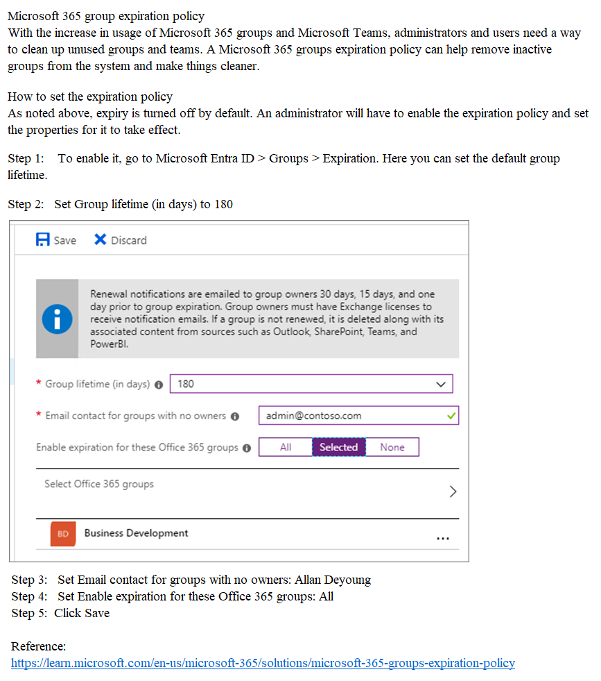  
------------------------------------------  
LAB2 - You need to prevent all users from using passwords that are variations of the word Falcon. To complete this task, sign in to the appropriate admin center  
url - entra.microsoft.com -> password protection / azure -> password protection      
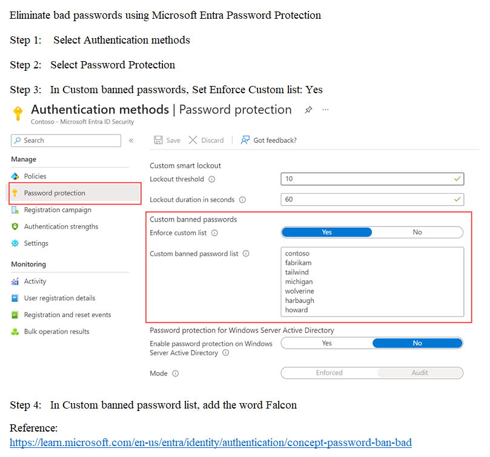  
------------------------------------------  
LAB3 - You need to assign a Windows 10/11 Enterprise E3 license to the sg-Retail group  
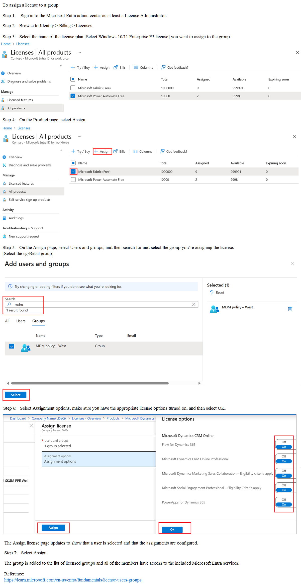  
------------------------------------------  
LAB4 - You need to create a group named Audit. The solution must ensure that the members of Audit can activate the Security Reader role  
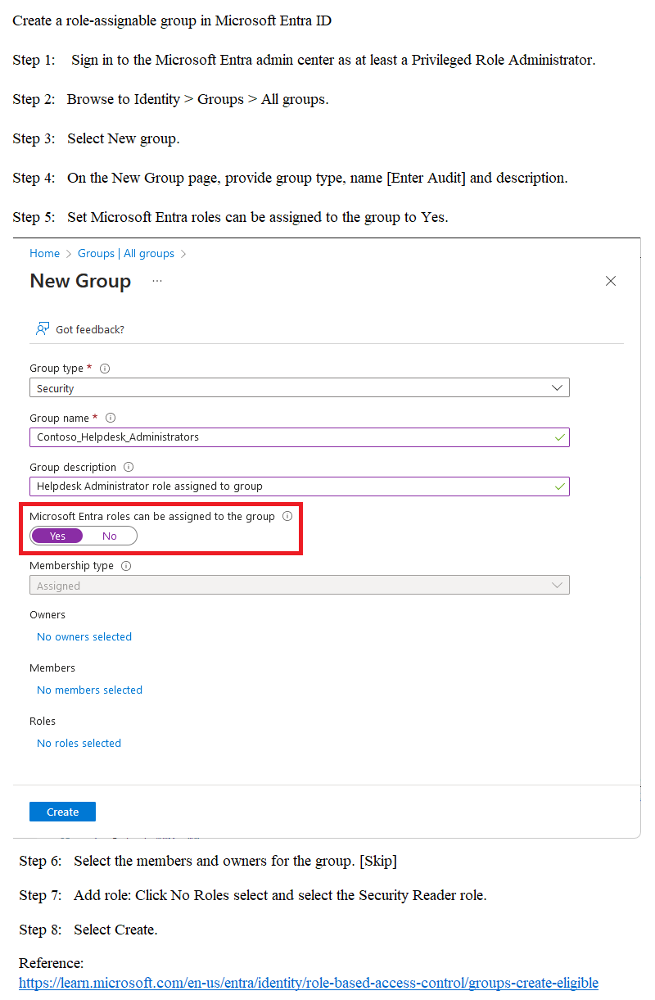  
------------------------------------------  
LAB5 - You need to ensure that users in the sg-Legal group must reauthenticate every 12 hours when they access any cloud apps managed by the tenant.  
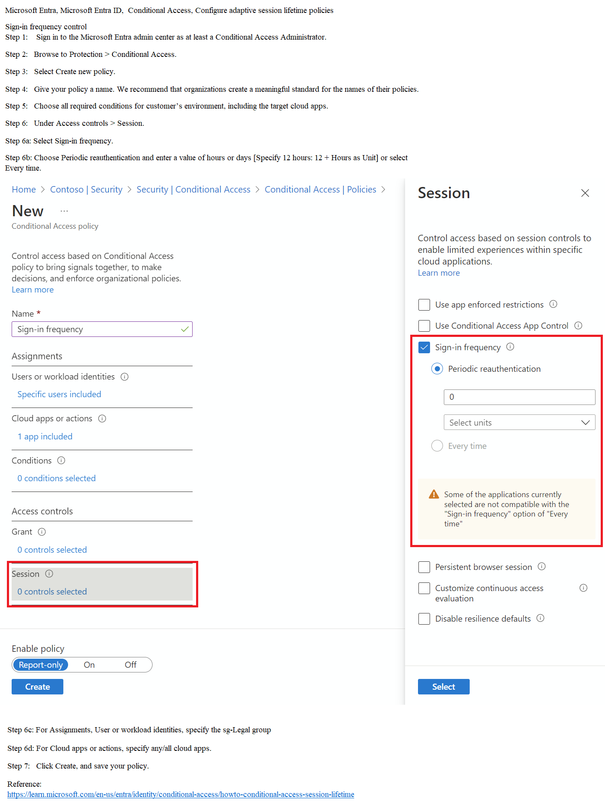
------------------------------------------  
LAB6 - You need to configure Microsoft Entra Identity Protection to meet the following requirements:  
• Require multi-factor authentication (MFA) for any sign-ins at the high risk level.  
• Apply the configuration to all users except for Mod Administrator.  
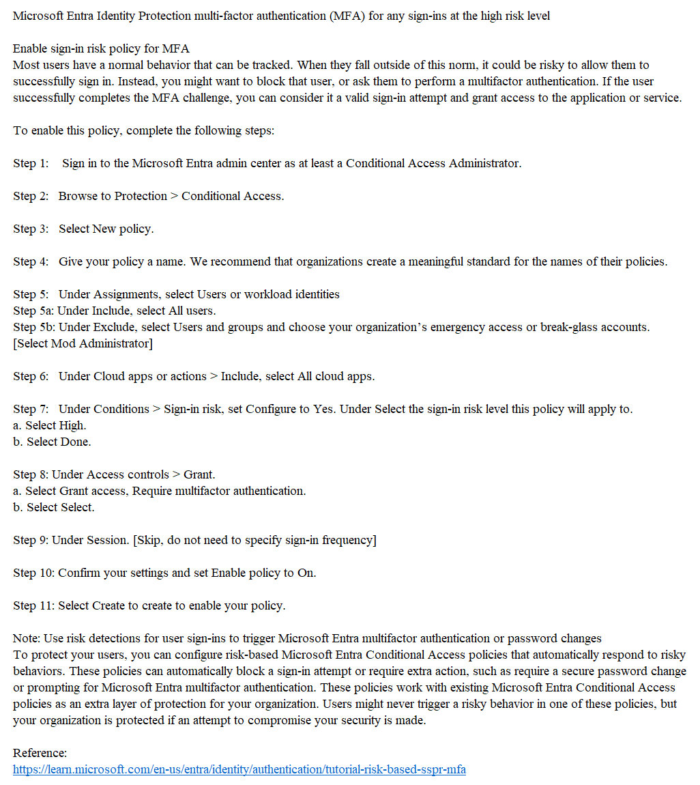
------------------------------------------  
LAB7 - You need to deploy multi factor authentication (MFA). The solution must meet the following requirements:  
• Require MFA registration only for members of the sg-Finance group.  
• Exclude Debra Berger from having to register for MFA.  
• Implement the solution without using a Conditional Access policy.  
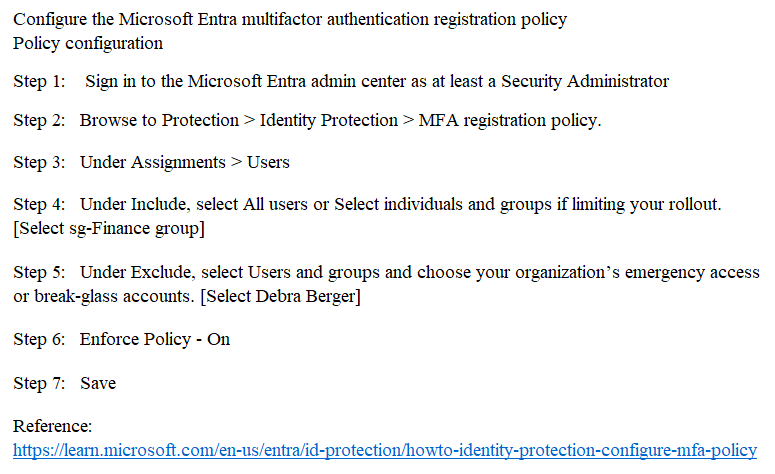
------------------------------------------  
LAB8 - You need to implement a process to review guest users who have access to the Salesforce app. The review must meet the following requirements:  
• The reviews must occur monthly.  
• The manager of each guest user must review the access.  
• If the reviews are NOT completed within five days, access must be removed.  
• If the guest user does not have a manager, Megan Bowen must review the access.  
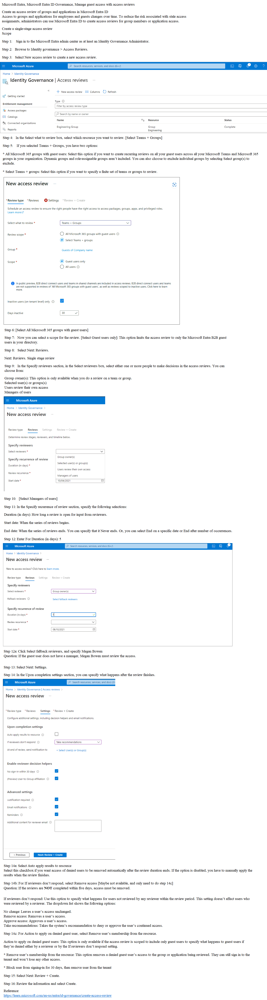  
------------------------------------------  
LAB9 - You need to add the LinkedIn application as a resource to the Sales and Marketing access package. The solution must NOT remove any other resources from the access package.  
To complete this task, sign in to the appropriate admin center.  
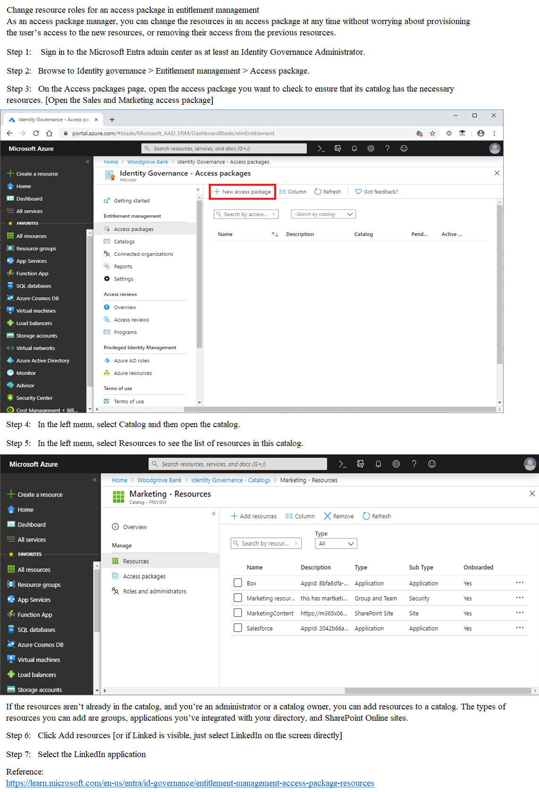  
------------------------------------------  
LAB10 - You need to implement additional security checks before the members of the sg-Executive can access any company apps. The members must meet one of the following conditions:  
• Connect by using a device that is marked as compliant by Microsoft Intune.  
• Connect by using client apps that are protected by app protection policies.  
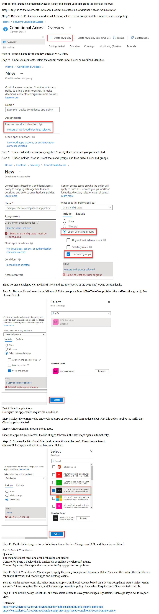
------------------------------------------  
LAB11 - You need to lock out accounts for five minutes when they have 10 failed sign-in attempts.  
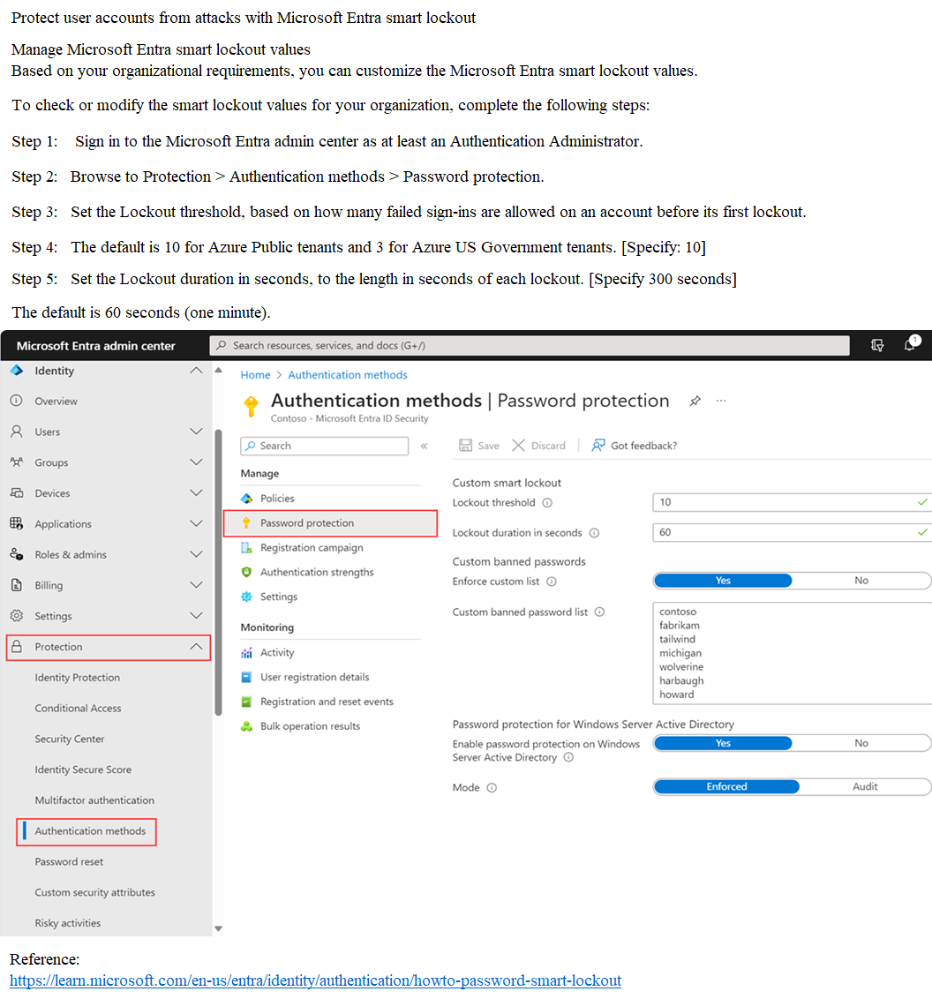
------------------------------------------  
LAB12 - You need to prevent all users from using legacy authentication protocols when authenticating to Microsoft Entra ID.  
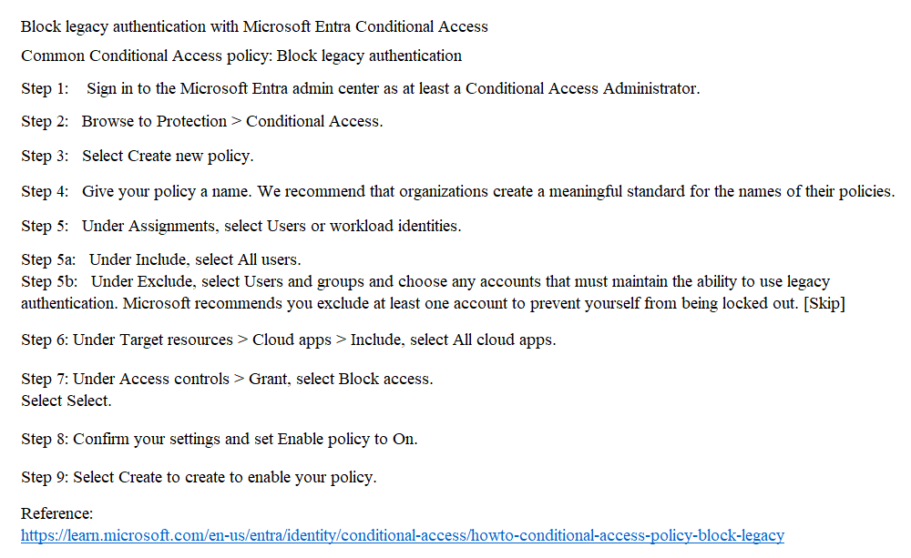
------------------------------------------  
LAB13 - You need to ensure that when users in the sg-Operations group go to the My Apps portal, a tab named Operations appears that contains only the following applications:  
• LinkedIn  
• Box  
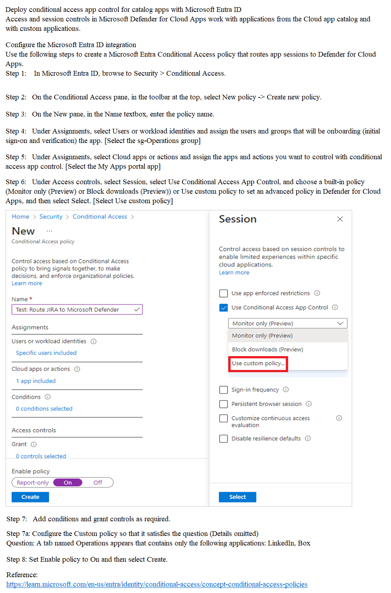  
------------------------------------------  
